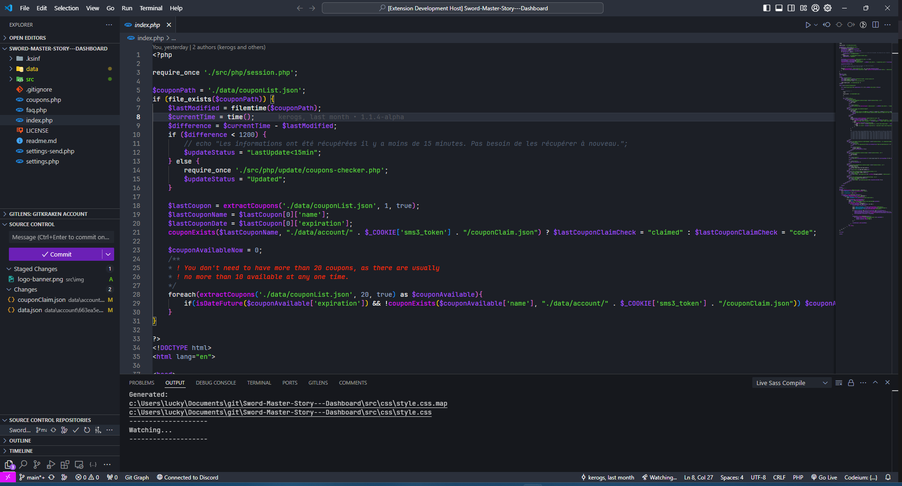

<h3>Doggui Pack</h3>

<h6>
<a href="">Github</a>
·
<a href="">Get started</a>
·
<a href="">Colors</a>
·
<a href="">Application</a>
·
<a href="">Information</a>
</h6>

<em>
Doggui offers a wide range of color themes designed to be pleasing to the eye and versatile. Each user can find a palette that perfectly matches his or her personal preferences. Open and community-based, Doggui invites everyone to participate and contribute to enriching the experience. Easy to use, it lets everyone personalize its interface with elegance and simplicity.
</em>

&nbsp;

## 💭 Inspiration and motivation
The creation of Doggui was mainly motivated by the lack of (pre-built) color palettes available for a variety of applications. Most of the themes present in each of the applications used by Doggui led me to create my own color palette to meet as many needs as possible. Doggui's inspiration was mainly driven by the Catppuccin theme. 

&nbsp;

## 🧠 Design Philosophy
- Doggui's themes are intended to be as free as possible. I.e., we want the themes to be able to go anywhere, but not to be monotonous or sad.
- We try to keep as many colors as possible that go together. We want each color to coexist with the other, without creating a color discrepancy such as one that's too bright or too dull in relation to the theme.
- We try to keep the color palette modern and colorful, so that everyone can appreciate it.
- Our aim is for color palettes to be used mainly in simple themes, without being filled to overflowing.

&nbsp;

## 🎨 Palette
Doggui currently comprises 3 different palettes, each with a different spirit. You can see them below. Their names refer to the breeds of dog to which they might be assigned.

You're free to use our palettes to your heart's content and modify them as you see fit. If you've created a color palette that you think belongs in Doggui, then feel free to send us a request.

We also try to spread Doggui's themes as widely as possible. So we create themes for as many applications as possible. You too can now publish a Doggui theme you've made for an application.

&nbsp;

<!-- Samoyède -->

☃️ samoyède

> [!NOTE]
> This color palette is currently being created... It will arrive very soon.

<!-- The Samoyed is a dog breed appreciated for its friendliness, kindness and bright appearance. Its thick, immaculate coat, mainly white, reflects a natural purity and luminosity. Inspired by this beauty, our "Samoyed" color palette features light, luminous tones, mainly white, creating a fresh, clean atmosphere. These colors are chosen to evoke the same clarity and elegance as the Samoyed coat, bringing a touch of freshness and serenity to any space. The "Samoyed" palette perfectly embodies the purity and warmth of this adorable breed, making every interface as welcoming and bright as a Samoyed's smile.

| |Labels|Hex|RGB|HSL|
|-|------|---|---|---| -->

&nbsp;

<!-- Jindo -->

🐕 Jindo

The Jindo is a Korean dog breed renowned for its beauty, intelligence and loyal character. Its coat can vary in a range of attractive colors, from white to russet brown. Inspired by this diversity and natural beauty, our "Jindo" color palette offers a selection of soft, harmonious pastel shades. These delicate, refined colors, ranging from soft pinks to pale blues, pastel greens and yellows, bring a touch of subtle, soothing beauty to any space. The "Jindo" palette reflects the elegance and chromatic diversity of this breed, creating a pleasant and aesthetically pleasing ambience, true to the spirit of Jindo.

&nbsp;

<!-- Eurasier -->

👑 Eurasier

The Eurasier is a breed of dog known for its gentleness, calm and loyalty. These dogs have thick, silky coats that vary in a palette of neutral colors, from gray to black to various shades of brown. This characteristic echoes our "Eurasier" color palette, which features elegant, soothing shades of gray. Like the temperament of Eurasier, these colors are chosen to create a serene, welcoming ambience, ideal for everyday use. The "Eurasier" palette offers a flexibility and visual harmony reminiscent of the balanced, adaptable nature of this exceptional breed.

| |Labels|Hex|RGB|HSL|
|-|------|---|---|---|

> [!NOTE]
> This color palette is currently being created... It will arrive very soon.

## 🚀 Application
Our themes are available for a variety of applications and more! If your application doesn't exist, why not add our theme to the application and add it to the list?

#### IDEs
- <a href="">Visual Studio Code (Comming Soon...)</a>

#### AI
- <a href="https://github.com/doggui-pack/ChatGPT">ChatGPT</a>

#### Social Networking
- <a href="">Discord (Comming Soon...)</a>
- <a href="https://github.com/doggui-pack/tiktok">TikTok</a>

#### ...

## ❤️ Gratitude
Thank
- [ Catppuccin ]( https://github.com/catppuccin ) The inspiration comes mainly from this theme. :)
- [ Comfy-Themes ](https://github.com/Comfy-Themes) Theme that I find inspiring and beautiful.